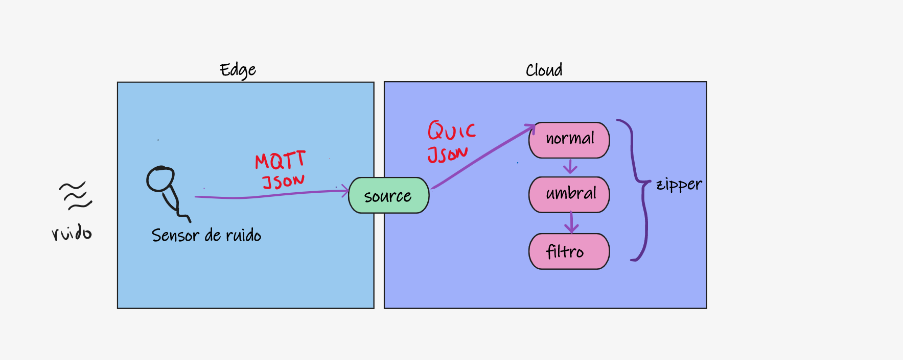

# talk-streams-reactive-golang
Proyecto para presentación en el guild de Golang donde se repasa el uso de streams en Go.

## Contenido
- [Introducción](#Introducción)
- [Motivación](#Motivación)
- [Repaso modelo de concurrencia en Golang](#Repaso-modelo-de-concurrencia-en-Golang)
  -  [Goroutines](#Goroutines)
  -  [Channels](#Channels)
  -  [RxGo](#RxGo)
- [Introducción a YoMo](#Introducción-a-YoMo)
  -  [QUIC](#QUIC)
  -  [Arquitectura](#Arquitectura)
  -  [Streams](#Streams)
- [Ejemplo práctico](#Ejemplo-práctico)
  -  [Planteamiento del problema](#Planteamiento-del-problema)
  -  [Requerimientos y metas](#Requerimientos-y-metas)
  -  [Consideraciones de diseño](#Consideraciones-de-diseño)
  -  [Diseño del sistema a alto nivel](#Diseño-del-sistema-a-alto-nivel)
  -  [Reto abierto](#Reto-abierto)
- [Conclusiones](#Conclusiones)
- [Referencias](#Referencias)

## Introducción

El objetivo de este repo es servir de tutorial para todos aquellos que quieran explorar el uso de streams y programación funcional reactiva para resolver problemas de procesamiento de datos en tiempo real usando golang.

- Existe una presentación asociada a este repo que la puede encontrar 👉[aquí](TODO)
- Cualquier sugerencia ó critica con mucho gusto será bien recibida: 📧 [ja.moralesv@hotmail.com](mailto:ja.moralesv@hotmail.com).

## Motivación

TODO

## Repaso modelo de concurrencia en Golang

A continuación se presenta un breve respaso del modelo de concurrencia de Golang:

### Goroutines

TODO

### Channels

TODO

### RxGo

TODO

## Introducción a YoMo

TODO

### QUIC

TODO

### Arquitectura 

TODO

### Streams

TODO

## Ejemplo práctico

### Planteamiento del problema

Es bien sabido que el nivel de ruido en las ciudades son los principales factores que afectan la calidad de vida de las personas ([¡Bajemos el volumen de las ciudades!](https://transecto.com/2021/09/bajemos-el-volumen-de-las-ciudades/)). En su localidad quieren tomar cartas en el asunto y para ello quieren saber el estado actual de la contaminación sonora. Para ello requiere hacer una prueba de concepto instalando sensores de ruido en varias ubicaciones estrategicas. 

### Requerimientos y metas

- (R) Los sensores entregan los datos a una frecuencia de 100 ms y es necesario normalizar los datos.

- (R) Se deben generar alarmas luego de superar un umbral.
- (D) Debido a que la variación del nivel de ruido puede crear falsas alarmas debido a fluctuaciones transitorias, sería deseable tener un promedio por ventanas de tiempo para [filtrar](https://es.wikipedia.org/wiki/Media_m%C3%B3vil) artefactos de alta frecuencia.

### Consideraciones de diseño

Para la prueba de concepto se supone que existen dispositivos IoT que envian frecuentemente medidas del nivel de ruido en una estructura de datos simple, que incluye:

- Medición (Noise) en un rango entre 0-200 dB
- Marca de tiempo en formato Unix Epoch
- Fuente: ubicación.

Por el momento las ubicaciones será nombres y no coordenadas de gps.

Debido a restricciones de energia se evitará usar microcontroladores potentes, por lo que los recursos computacionales dentro de los dispositivos sensores, solo deben usarse para capturar los datos del sensor y enviarlos a traves del protocolo de comunicación escogido, puede ser [ZigBee](https://zigbeealliance.org/solution/zigbee/) o [LoRa](https://lora-alliance.org/). El equipo de Ingeniería de Hardware aun no ha tomado la decisión.

### Diseño del sistema a alto nivel

De acuerdo a las consideraciones anteriores, se propone la siguiente estructura para la prueba de concepto:

Para mas ejecutar el demo puede referirse al proyecto [yomo-noise](./yomo-noise/README.md).

### Reto abierto

La implementación actual no usa programación reactiva para la realización de las funciones que procesan los flujos de eventos. Sin embargo si queremos que la prueba de concepto sirva como base para una implementación real la expresividad proporcionada por las extensiones reactivas, puede impactar positivamente en la mantenibilidad global del sistema.

Se propone entonces re-implementar las funciones usando RxGo.

Sientase libre de descargar el código y proponer un PR con su solución al reto abierto planteado.

## Conclusiones

En este tutorial se exploraron los conceptos de _stream_, _quic_, _serverless_ y ademas plantea una aplicación práctica de los mismos en un ejercicio sencillo.

## Referencias

- Go in Action, William Kennedy, Brian Ketelsen, Erik St. Martin, Manning, 2016
- Hands-On Software Architecture with Golang, Jyotiswarup Raiturkar, Packt Publishing, 2018
- Making Sense of Stream Processing, Martin Kleppman, O’Reilly Media, 2016
- https://github.com/ReactiveX/RxGo, Revisado el 2 de noviembre 2021
- https://www.callstats.io/blog/2017/02/03/web-protocols-http2-quic , Revisado el 2 de noviembre 2021
- https://blog.chromium.org/2015/04/a-quic-update-on-googles-experimental.html , Revisado el 2 de noviembre 2021
- https://docs.yomo.run/ , Revisado el 2 de noviembre 2021
